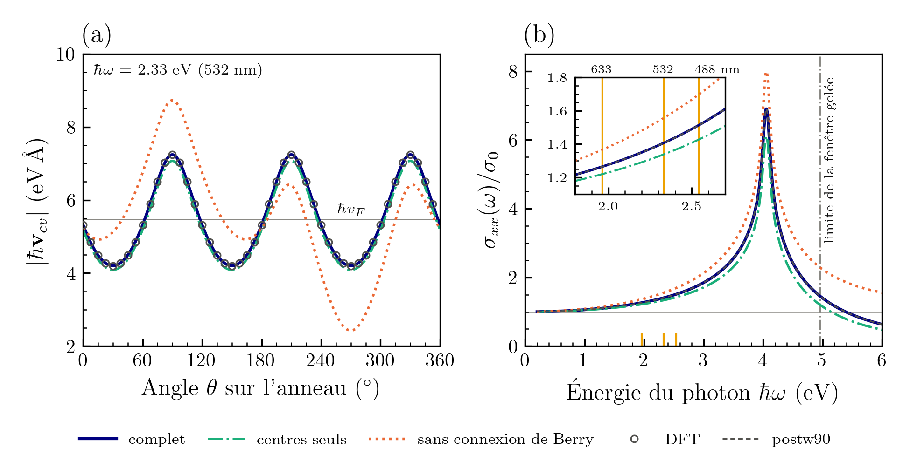

# EM3 — Figure et chiffres du §2.5 (couplage électron-photon)

Session locale du 2026-09-29, prompt EM3 de Greg. Rien d'écrit dans `src/`, `tests/` ni le mémoire ; rien de commité.

## Résumé

1. Tous les fichiers attendus étaient présents : `EM2/em2_A.npz`, les `kubo_S` de `k1201` et `k1201_ti`, `em2_B_compare.py`.
2. `make_em3_data.py` écrit la courbe postw90 `transl_inv`, l'anneau de 2.33 eV (trois variantes) et le tableau. Les quatre contrôles passent.
3. La figure `fig_em_coupling` est refaite. (a) |ħv_cv|(θ) à 2.33 eV : le mode complet passe par les 48 points DFT. Sans Berry, la moyenne est juste, mais la courbe perd la symétrie C₃. (b) σ_xx/σ₀ : postw90 est superposé au mode complet.
4. Tableau complet dans `em_table.md` et `.csv`. Le biais en η vaut **6.6×10⁻⁴** à 2.33 eV (et non 6.7) ; tous les autres chiffres du prompt sont retrouvés.
5. EM.md réaligné (diff relu et accepté par Greg le 2026-09-29). Une partie de l'étape 1 était déjà dans EM.md (réalignement EM2 du 2026-09-29).

## Étape 0 — Inventaire

- `memoire/EM/EM2/` : `em2_A.npz` (84 k, dont 48 sur l'anneau de 2.33 eV aux angles multiples de 7.5°), `em2_kpoints_table.txt`, `postw90/k1201{,_ti,_ti_nows}/wannier-kubo_S_*.dat`. `em2_postw90_sigma.npz` est écrit par `em2_B_compare.py`, depuis `k1201` seulement.
- `memoire/EM/M4_sigma/` : `em_sigma_{full,centres_only,no_berry}_N1200_eta0.04.npz`, `em_map_K.npz`, `em_ring_stats.json`, `em_scalars.json`, `em_table.{tex,csv}`, `pilote/`.
- `scripts/make_figures_em.py` : nom de figure `fig_em_coupling`, gardé.

## Étape 2 — Données (`make_em3_data.py`, < 1 s)

- **`em2_postw90_sigma_ti.npz`** :
  - même lecteur (`read_postw90`, importé d'`EM2/em2_B_compare.py`) et même format que `EM2/em2_postw90_sigma.npz`, plus `transl_inv=True` ;
  - l'en-tête de `k1201_ti/wannier.win` est vérifié : `transl_inv = true`, 1201², w = √2 η ;
  - le fichier est écrit dans `EM3/`, et non dans `EM2/`, qui est la copie de rorqual (règle 5).
- **`em3_ring_2p33.npz`** :
  - `ring(tb, K, 2.33, mu=E_D, ntheta=720)` ;
  - |ħv_cv| dans le plan pour les trois variantes, avec c et v choisis par énergie autour de E_D ;
  - ħv_F = 5.46919 eV·Å (`em_scalars.json`).
- **Contrôles** (`make_em3_data.log`) :

| Contrôle | Attendu | Obtenu |
|---|---|---|
| \|ħv_cv\| aux 48 k DFT, recalculé − `em2_A.npz` (trois variantes) | ≤ 10⁻¹⁰ | 1.5×10⁻¹⁴ eV·Å |
| grille de 720 angles, un point sur 15 : θ et \|ħv_cv\| contre `em2_A.npz` | même θ, ≤ 10⁻¹⁰ | θ identiques, 3.5×10⁻¹³ eV·Å |
| σ_xx/σ₀ complet de M4 aux lasers | 1.2637, 1.4056, 1.5115 | 1.26367, 1.40555, 1.51148 |
| postw90 `transl_inv` − M4 à 2.33 eV (xx) | ≈ −4.4×10⁻⁴ | −4.41×10⁻⁴ |
| postw90 `transl_inv` à 0.2 eV (spin appliqué) | ≈ 1.002 | 1.00236 |

## Étape 3 — Figure

`scripts/make_figures_em.py` → `figures/fig_em_coupling.{pdf,png}`, 6.5 × 3.3 po, légende commune sous les panneaux.

- (a) |ħv_cv| sur l'anneau de 2.33 eV, θ de 0 à 360°.
  - Complet : marine, trait plein. Centres seuls : vert, trait mixte. Sans Berry : orange, pointillé. DFT : 48 cercles gris ouverts. Droite ħv_F en gris fin.
  - Complet et DFT sont périodiques de 120° : maximums 7.24 eV·Å à 90, 210 et 330°, minimums 4.20 eV·Å à 30, 150 et 270°.
  - Sans Berry perd C₃ : 8.73 eV·Å à 90° et 2.43 eV·Å à 270°. Sa moyenne sur l'anneau reste juste (−0.02 % contre la DFT), mais son écart point par point va de −42 à +28 %.
- (b) σ_xx/σ₀ de 0.2 à 6 eV :
  - les trois variantes, avec le même code que (a) ;
  - postw90 `transl_inv` en tirets gris fins ;
  - droite σ/σ₀ = 1 ;
  - ligne ħω_froz = 4.96 eV, annotée « limite de la fenêtre gelée » ;
  - repères laser jaunes en bas de l'axe ;
  - médaillon de 1.8 à 2.7 eV avec les trois lasers ;
  - l'axe y monte jusqu'à 8.5 pour montrer le pic sans Berry (7.99 à 4.06 eV).

**Légende proposée (pour P28)** :

> **Figure 2.x** — Couplage électron-photon du graphène par interpolation de Wannier (wannierisation 27×27, PBE). (a) Norme dans le plan |ħ**v**_cv| = (|ħv^x_cv|² + |ħv^y_cv|²)^{1/2} de l'élément de matrice de vitesse π → π* sur l'anneau résonant ε_c(**k**) − ε_v(**k**) = 2.33 eV (532 nm), en fonction de l'angle θ de **q** = **k** − K mesuré depuis l'axe x (parallèle à une liaison C–C). Trait plein : vitesse complète, éq. (2.5.x). Trait mixte : connexion de Berry réduite aux centres des fonctions de Wannier (approximation des liaisons fortes). Pointillé : sans connexion de Berry, ħ**v** ≈ V†∂_**k**H V (éq. (2.5.7) de la version précédente), en jauge du réseau e^{i**k**·**R**} avec les mailles d'attache choisies par Wannier90. Cercles : DFT directe, ⟨c|**p̂**|v⟩ de Quantum ESPRESSO avec le commutateur du potentiel non local. Droite : ħv_F = 5.469 eV·Å. (b) Conductivité optique interbande σ_xx(ω)/σ₀, σ₀ = e²/4ħ, pour les trois variantes : grille 1200 × 1200, gaussienne d'écart-type η = 0.04 eV, μ au point de Dirac, T = 0. Tirets : postw90 (Wannier90 3.1, `transl_inv`, facteur de spin 2 ajouté). Médaillon : agrandissement autour des trois énergies laser (633, 532 et 488 nm). Au-delà de la ligne verticale (4.96 eV), les états π* sortent de la fenêtre gelée de la wannierisation et l'interpolation n'y est plus exacte.

## Étape 4 — Tableau (`em_table.md`, `em_table.csv`)

Tous les nombres sont générés, sans recopie à la main. La seule exception est le budget d'hermiticité, 1.3×10⁻³, qui vient d'EM.md §5 (F10).

- **ħv_F** : Wannier 5.4692 eV·Å, DFT 5.46977 eV·Å ; v_F = 8.309 et 8.310×10⁵ m/s.
- **|ħv_cv| contre la DFT directe** (min / moy. / max, %) :

| Anneau | complet | centres seuls | sans Berry |
|---|---|---|---|
| 1.96 eV | −0.042 / −0.013 / +0.002 | −1.96 / −1.83 / −1.75 | −33.8 / −0.09 / +22.5 |
| 2.33 eV | −0.040 / −0.017 / −0.000 | −2.75 / −2.55 / −2.39 | −42.2 / −0.02 / +28.1 |
| 2.54 eV | −0.035 / −0.017 / −0.005 | −3.25 / −3.00 / −2.78 | −47.3 / +0.05 / +29.4 |

- **⟨|e_x·ħv_cv|²⟩** en (ħv_F)²/2, complet / centres / sans Berry :
  - 1.0375 / 1.0006 / 1.1307 (1.96 eV) ;
  - 1.0512 / 0.9995 / 1.1835 (2.33 eV) ;
  - 1.0594 / 0.9984 / 1.2170 (2.54 eV).
- **⟨|e_y·ħv_cv|²⟩** : pour les modes avec Berry, égal à e_x à 10⁻⁴ près. Sans Berry, il est égal aux centres seuls.
- **Rapport centres/complet** : 0.964, 0.951, 0.942.
- **σ/σ₀ aux lasers** : complet 1.2637 / 1.4056 / 1.5115 ; postw90 `transl_inv` 1.2634 / 1.4051 / 1.5110 (−2.4, −4.4, −5.0×10⁻⁴). Les centres seuls, et le sans Berry en xx et en yy, sont aussi dans `em_table.md`.
- **Pic de van Hove** : 4.05 eV (position seulement). **ħω_froz** = 4.9595 eV.
- **Budgets à 2.33 eV** :

| Source | Valeur |
|---|---|
| hermiticité de r | 1.3×10⁻³ de ħv_F |
| DFT directe (contrôle) | 4.2×10⁻⁴ |
| biais en η | +6.6×10⁻⁴ |
| préfacteur | −3.1×10⁻⁴ |
| `use_ws_distance` | −1.3×10⁻⁴ |

`M4_sigma/em_table.tex` (le `tabular` du mémoire) reste tel quel. On y ajoutera la colonne postw90 en P28 si Greg le veut.

## Écarts au prompt et remarques

1. **Centres seuls gardés en (b)**. Le prompt ne les liste que pour (a), mais la règle « mêmes couleurs pour les mêmes variantes » et l'écart visible aux lasers (−5 %) plaident pour les garder. Une ligne à retirer si Greg préfère.
2. **Médaillon gardé en (b)**. En pleine échelle, les variantes ne diffèrent que de 0.07 à 0.15 aux lasers, sur un axe de 8.5. Le médaillon rend ces écarts lisibles, et les repères laser du panneau principal restent discrets.
3. **Biais en η** : 6.6×10⁻⁴, par Richardson sur η = 0.02 et 0.04 (pilote, N = 1200). Le pilote donne a = 0.414 et 0.415 selon la paire ; le « 0.42 η², 6.7×10⁻⁴ » d'EM.md §8 était un arrondi.
4. **Numérotation** : le §11 du prompt est le §12 d'EM.md (le §11 porte les Perspectives).
5. **Déjà dans EM.md**, fait lors du réalignement EM2 du 2026-09-29 : §0 (non local vérifié), §2 (budget confirmé), décision 4 (chiffres réels, origine de l'anisotropie), §10 EM2 (spin, √2 η, conversion, défauts liés à `dis_froz_max`, binaire série, `transl_inv`). Le diff ne fait que compléter.

## Fichiers

`memoire/EM/EM3/` : `README.md`, `EM3_rapport.md`, `make_em3_data.py`, `make_em3_data.log`, `em2_postw90_sigma_ti.npz`, `em3_ring_2p33.npz`, `em_table.md`, `em_table.csv`. Hors du répertoire : `scripts/make_figures_em.py`, `figures/fig_em_coupling.{pdf,png}`.
